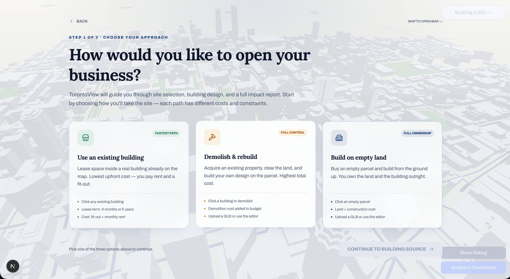
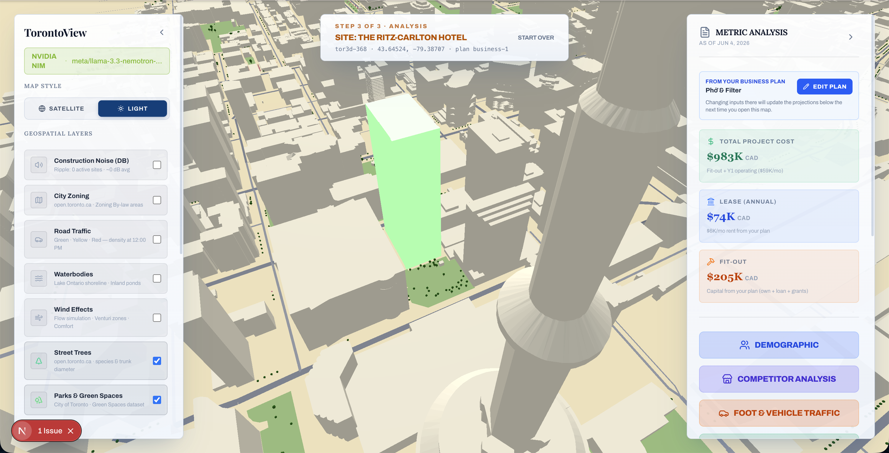
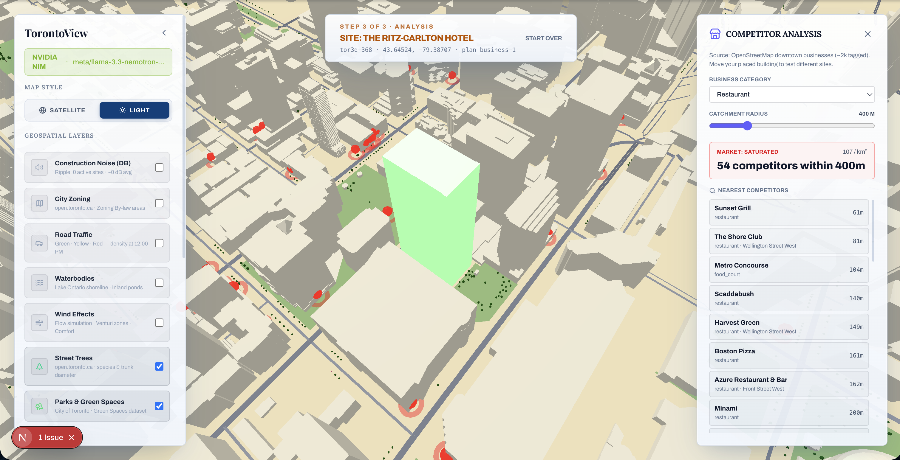
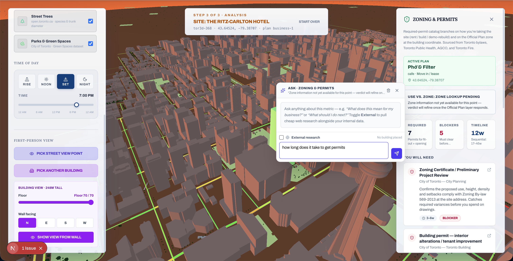
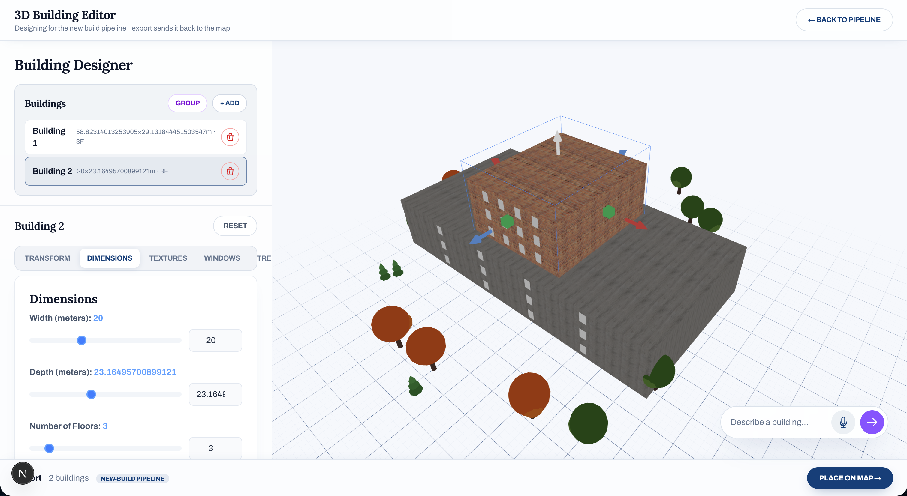
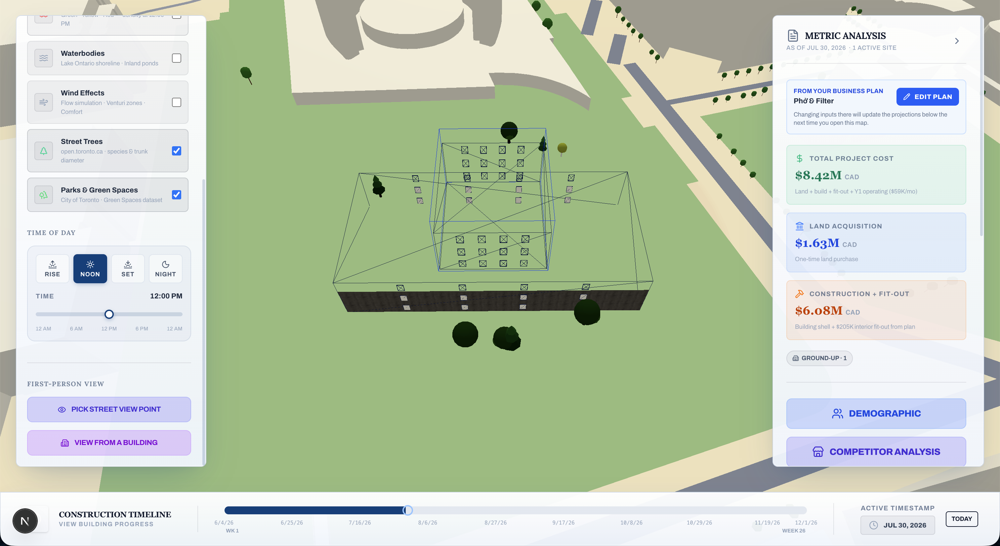

# TorontoView

**A 3D urban planning platform where you design buildings with your voice, place them on a live map of Toronto, and simulate environmental impact -- before the first shovel hits the ground.**

Built for the City of Toronto at Nvidia Spark Hackathon 2026.

> **Built on the NVIDIA AI stack.** Reasoning runs on NVIDIA NIM (build.nvidia.com) by default — Nemotron, Llama-3.3-Nemotron, and a Toronto-specific LoRA fine-tuned on DGX Spark. Every LLM-backed feature (voice design, environmental report, agent council, the new AI Insights layer over the simulations) routes through a unified provider abstraction with a `/settings` model picker. See [`docs/NVIDIA_STACK.md`](./docs/NVIDIA_STACK.md).

---

## 1. Project Overview

TorontoView is a real-time, voice-driven urban planning simulator built on top of a 3D model of Toronto, Ontario. It allows city planners, residents, and public officials to design buildings using natural language, place them at real-world coordinates, and immediately see the projected environmental, traffic, and community impact.

The platform combines three core technologies into a single interactive experience:

- **NVIDIA AI stack** provides the reasoning layer — NVIDIA NIM (build.nvidia.com) for hosted inference against the Nemotron family, plus a self-hosted DGX Spark endpoint serving a domain-specific Toronto Council LoRA. Every LLM-backed feature in TorontoView routes through this stack: voice building design, environmental impact reports, the four-agent council that reviews proposals against Toronto regulations, tree recommendations, and the new **AI Insights** layer that pipes deterministic simulation outputs (drainage, traffic, shadow, wind/noise) through an NVIDIA-served model to generate concrete recommendations.
- **ElevenLabs** provides the voice and audio layer -- real-time narration of building designs, AI-generated sound effects for every editor action, and spoken feedback that makes the tool accessible to users who cannot or prefer not to read dense technical output.
- **Three.js and React Three Fiber** power a full 3D simulation of Toronto with over 100 vehicles, real traffic signals, A* pathfinding, construction noise propagation, and zoning overlays.

The result is a platform where anyone -- regardless of technical skill, visual ability, or planning expertise -- can participate in shaping their city.

---

## 2. Live Demo

**Try it now:** [https://torontoview.vercel.app](https://torontoview.vercel.app)

**Watch the demo:** [https://youtu.be/3HSv8uiZT9Y](https://youtu.be/3HSv8uiZT9Y)

### What to try first

1. **Open the Build page** -- Navigate to the Building Editor.
2. **Use Voice Design** -- Click "Design with Voice" and say something like:
   - *"Make me a 5-story modern glass tower with a flat roof"*
   - *"A small brick house with arched windows and a gable roof"*
   - *"A 10-floor concrete office building, 20 meters wide"*
3. **Listen** -- ElevenLabs will speak back a confirmation of what was built.
4. **Hear the sounds** -- Every action in the editor (adding floors, resizing, rotating, placing windows) triggers an AI-generated sound effect created by ElevenLabs.
5. **Open the Map** -- Place your building on Toronto's live 3D map.
6. **Zoom into a street** -- Scroll in close to street level and hear an AI-generated metropolitan city ambiance produced by ElevenLabs in real time. The volume fades smoothly based on how close you are to the ground.
7. **Generate an Environmental Report** -- See carbon footprint, noise levels, habitat impact, and community effects analyzed by a local model.
8. **Ask the Tree Advisor** -- Get tree recommendations from Toronto's official planting program, powered by a local model.

### Screenshots

**3D Toronto map with environmental layers and live metrics**


**Street-level night view at the CN Tower**


**Guided onboarding — pick how you'll take the site (existing building, demolish & rebuild, or empty land)**


**Site analysis — proposed building rendered in 3D with project cost, lease, and construction estimates**


**Competitor analysis — nearby businesses by category within a configurable radius**


**Grants & funding matches — relevant municipal and provincial programs surfaced from official sources**


**Zoning & permits — required permits, blockers, and an Ask-AI prompt grounded in the zoning context**


**3D Building Editor — voice-driven design, dimension sliders, and live preview**


**Construction timeline — phased build progress on the map with an active timeline scrubber**


---

## 3. What it does

TorontoView makes urban planning conversational, audible, and visual -- all at once.

1. The user speaks a building description (e.g., *"A 3-story brick building with round windows"*)
2. A local Qwen/Gemma model interprets the request and generates a structured JSON configuration
3. The configuration is validated against a Zod schema with automatic retry on failure
4. The 3D building renders instantly in the editor
5. ElevenLabs narrates a spoken confirmation of what was built
6. The user places the building on Toronto's 3D map, sets a construction timeline, and generates a full environmental impact report

Non-technical users, seniors, and visually impaired users can participate in city design. The barrier to civic engagement drops from "knows CAD software" to "can describe a building in a sentence."

---

## 4. Architecture

```
Voice Input -> Web Speech API -> /api/design -> Local LLM (parse + validate)
                                                      v
                                              3D Building Editor (Three.js)
                                              + ElevenLabs Sound Effects (9 AI-generated sounds)
                                                      v
                                              /api/speak -> ElevenLabs TTS (spoken confirmation)
                                                      v
                                              3D Toronto Map (100+ vehicles, traffic, zoning)
                                              + /api/street-sound -> ElevenLabs Sound Gen (city ambiance on zoom)
                                                      v
                              /api/environmental-report -> Local LLM (carbon, noise, habitat, community)
                              /api/tree-advisor -> Local LLM (40+ Toronto tree species, planting advice)
```

---

## 5. ElevenLabs Integration

ElevenLabs is not a cosmetic addition to TorontoView. It is a core layer of the platform that makes the tool accessible, engaging, and usable in contexts where visual interfaces alone are insufficient.

### 5.1 Real-Time Voice Narration (Text-to-Speech API)

When a user designs a building by voice, TorontoView does not simply display the result on screen. It speaks the result back.

After the local model generates a building configuration, a one-sentence confirmation is sent to the ElevenLabs Text-to-Speech API via the `/api/speak` endpoint. The confirmation is streamed as MP3 audio and played immediately in the browser.

This voice feedback serves several critical purposes:

- **Accessibility:** Users with visual impairments or reading difficulties receive confirmation of their design without needing to read anything on screen.
- **Hands-free interaction:** Users operating the tool in a presentation, public meeting, or classroom setting can keep their attention on the 3D view while receiving audio confirmation.
- **Public consultation:** In a city hall presentation, a planner can speak a building description and the audience hears the system respond -- creating a conversational, transparent design process.
- **Error correction:** If the system misinterprets a request, the spoken confirmation makes the misinterpretation immediately obvious, allowing the user to correct it in their next voice command.

### 5.2 AI-Generated Sound Effects (Sound Generation API)

Every interaction in the Building Editor is accompanied by a sound effect generated by the ElevenLabs Sound Generation API. These are not stock audio files. Each sound was generated from a natural-language prompt describing the desired audio experience.

**Nine custom sounds were generated:**

| Editor Action | ElevenLabs Prompt | Duration |
|---------------|-------------------|----------|
| Place object | "A fast whoosh followed by a soft landing thud, like something flying in and dropping into place" | 1.0s |
| Add floor | "A satisfying plastic lego brick snapping and clicking into place, crisp snap click sound, short and punchy" | 0.6s |
| Resize building | "A rubber stretching and elastic pulling sound, like a material being stretched out longer with tension" | 1.0s |
| Change texture | "A quick light whoosh, like a card being flipped or a page turning fast in the wind" | 0.6s |
| Place brick | "A fast smooth whoosh sound effect, like an object flying through the air and landing" | 0.8s |
| Rotate object | "A quick spinning whoosh, like something rotating fast through the air with a smooth swooshing wind sound" | 0.7s |
| Move object | "A smooth gliding whoosh, like an object sliding quickly through the air" | 0.8s |
| Edit window | "A light airy whoosh, like a curtain being pulled open quickly" | 0.6s |
| Add window | "A solid block clicking into place with a satisfying snap and a short bam" | 0.7s |

The sound generation script (`scripts/generate-sounds.mjs`) calls the ElevenLabs Sound Generation API at `https://api.elevenlabs.io/v1/sound-generation` for each prompt and saves the resulting MP3 files to `public/sounds/building/`.

**Sound playback architecture:**

The `SoundManager` class (`lib/editor/utils/SoundManager.ts`) manages all sound playback with:

- **Audio caching:** All nine sounds are preloaded on first use to eliminate latency.
- **Cooldown system:** Each sound has a cooldown (100--400ms) to prevent overlap during rapid interactions like slider adjustments.
- **Clone-based playback:** Audio elements are cloned for each play event, allowing multiple simultaneous sounds.
- **Volume control and mute toggle:** Users can adjust or disable sounds.

### 5.3 Street-Level Ambient Sound (Sound Generation API -- Real-Time)

When a user zooms into street level on the 3D Toronto map, ElevenLabs generates a metropolitan city ambiance in real time. The `/api/street-sound` endpoint calls the ElevenLabs Sound Generation API with a prompt describing a busy urban street -- car horns, engines, pedestrians, distant sirens -- and streams the resulting audio back to the browser.

**How it works:**

1. The 3D map tracks the camera's distance from the ground in every animation frame.
2. When the camera crosses the street-level threshold (< 200 world units), the client calls `/api/street-sound`.
3. ElevenLabs generates a 5-second metropolitan city ambiance clip from a natural-language prompt.
4. The audio plays in a loop with volume that scales smoothly based on zoom distance -- closer to the street means louder ambiance.
5. When the user zooms back out, the sound fades and stops.
6. The audio is cached client-side so subsequent zoom-ins replay instantly without another API call.

This creates an immersive experience where zooming into Toronto's streets feels like walking down a real city block. The sound is not a pre-recorded stock file -- it is generated by ElevenLabs from a text description, the same way the editor sound effects are created.

---

## 6. NVIDIA AI Reasoning Layer

TorontoView routes every LLM call through a unified multi-provider client (`lib/llm/`). The default provider is **NVIDIA NIM** at `https://integrate.api.nvidia.com/v1`; users can switch to the self-hosted **NVIDIA DGX** endpoint (which serves the agent-council LoRA fine-tuned in `training/agent-council-lora/`), a local llama.cpp / vLLM server, or hosted OpenAI from the `/settings` page. Selection is persisted in `localStorage` and forwarded to API routes via `x-tv-provider` / `x-tv-model` headers, so the user's pick steers every feature consistently.

### Provider catalog (selectable from `/settings`)

- `meta/llama-3.3-nemotron-super-49b-v1` — flagship reasoning model for project briefs and structured output
- `nvidia/llama-3.1-nemotron-70b-instruct` — general instruction-tuned chat
- `nvidia/nemotron-mini-4b-instruct` — low-latency voice-design parsing
- `mistralai/mixtral-8x22b-instruct-v0.1` — Mixtral via NIM
- `toronto-council-lora` — our DGX-trained LoRA, served from the on-prem `nvidia-dgx` provider
- `unsloth/Qwen3.6-35B-A3B-GGUF` (local dev fallback) and `gpt-4o-mini` (OpenAI fallback)

### LLM-backed features

### 6.1 Voice Design Parser (`/api/design`)

Converts natural language like *"Make me a tall glass building with round windows"* into a structured building configuration (floors, dimensions, materials, roof, windows, color). The local model resolves ambiguity -- *"tall"* becomes 8 floors, *"glass"* maps to both texture and wall color, *"round windows"* resolves to the `circular` enum. Output is validated against a Zod schema with up to 3 automatic retries. Supports incremental editing: *"Make it taller"* updates only the relevant fields.

### 6.2 Environmental Impact Report (`/api/environmental-report`)

Generates a full environmental and societal impact report for buildings placed on Toronto's map. Covers carbon footprint, habitat disruption, water impact, air quality, traffic projections, noise levels, community effects, risk classification, mitigation measures, and overall sustainability scores (0--100). Grounded in Toronto's geography, zoning, and Great Lakes-St. Lawrence ecosystem.

### 6.3 Tree Advisor (`/api/tree-advisor`)

Recommends tree species from Toronto's Neighbourhood Tree Planting Program -- a real municipal dataset of 40+ species. Returns species selection, planting density, radius, reasoning, and tips. All recommendations are validated against the official Toronto dataset.

### 6.4 Agent Council (`/api/agent-council/review`) — Toronto Council LoRA on DGX

Four specialized advisors (Building Regulations, Business Bursaries, Business Viability, Civil Infrastructure) review a proposal in parallel and vote. When `DGX_INFERENCE_BASE_URL` is set, this route uses the **Toronto Council LoRA** fine-tuned on DGX Spark from Toronto's official municipal corpus; otherwise it falls back to NIM. Behavior lives in the LoRA, facts live in the RAG corpus under `data/agent-council/` — see `training/agent-council-lora/README.md`.

### 6.5 AI Insights — NVIDIA-served reasoning over deterministic simulations

The deterministic water/drainage, traffic, shadow, and wind/noise simulations run locally. Each panel exposes an **Ask NVIDIA AI** button that POSTs the simulation output to a dedicated NIM-served endpoint and returns a Zod-validated structured recommendation (`{ summary, risks, recommendations, scores }`):

- `/api/insights/water-impact` — stormwater/drainage recommendation
- `/api/insights/traffic-impact` — congestion + mode-split advice
- `/api/insights/shadow-impact` — daylight occlusion mitigation
- `/api/insights/wind-noise` — wind comfort + construction-noise recommendation
- `/api/insights/project-brief` — combined NVIDIA-generated brief across all four

This is the seam where the platform meets the NVIDIA stack: GPU-accelerated simulations on the client, reasoning on NVIDIA inference. See `lib/insights/promptTemplates.ts` for the system prompts.

---

## 7. Accessibility and Inclusion

TorontoView was designed with accessibility as a primary constraint, not an afterthought. The entire building design workflow can be completed without touching a keyboard or reading output -- press "Design with Voice," describe the building, and hear the spoken confirmation from ElevenLabs.

This serves **visually impaired users**, **seniors**, **non-native English speakers**, and **motor-impaired users**. The user never needs to learn parameter names, unit systems, or menu structures. TorontoView requires the ability to describe a building in a sentence -- nothing more.

---

## 8. Impact and Use Cases

- **City planning** -- Describe a development, place it on the map, and generate an environmental impact report in under a minute.
- **Public consultations** -- Project TorontoView at a town hall. A facilitator speaks, the audience sees the 3D result, and ElevenLabs narrates the output. Residents suggest modifications verbally in real time.
- **Education** -- Students prototype developments and see environmental consequences without learning CAD software.
- **Real estate** -- Developers test designs against zoning codes and generate preliminary impact reports before engaging consultants.

---

## 9. Technical Stack

### NVIDIA AI Stack (headline)

| NVIDIA layer | Component | Role in TorontoView |
|---|---|---|
| Systems | **DGX Spark** | Fine-tuning the Toronto Council LoRA from Toronto's official corpus (`training/agent-council-lora/`). |
| Software | **NGC Containers** (`nvcr.io/nvidia/pytorch:26.04-py3`) | Reproducible CUDA + PEFT + TRL training environment. |
| Platforms | **NVIDIA NIM** (build.nvidia.com) | Default inference provider — Nemotron variants serve voice design, environmental reports, tree advisor, agent council, and the five AI Insights routes. |
| Models | **Nemotron family** + **Toronto Council LoRA** | Selectable from `/settings`; user choice forwarded via `x-tv-provider` / `x-tv-model` headers. |

See [`docs/NVIDIA_STACK.md`](./docs/NVIDIA_STACK.md) for the full feature → NVIDIA-layer mapping.

### Application stack

| Layer | Technology |
|-------|------------|
| Frontend | Next.js 16, React 19, TypeScript, Tailwind CSS, Framer Motion |
| 3D Engine | Three.js, React Three Fiber, Drei |
| LLM Reasoning | NVIDIA NIM (default) → NVIDIA DGX (LoRA) → local llama.cpp/vLLM → OpenAI (fallback chain). Provider abstraction in `lib/llm/`. |
| Voice and Sound | ElevenLabs Text-to-Speech API, ElevenLabs Sound Generation API (editor effects + real-time street ambiance), Web Speech API |
| Validation | Zod (schema validation with retry) |
| Geospatial | Turf.js, OpenStreetMap data, lat/lng projection |
| Traffic Simulation | A* pathfinding, spatial grid collision detection, signal coordination, vehicle state machine |
| Data Sources | Toronto Official Plan zoning (76 zones), Toronto tree planting program (40+ species), OpenStreetMap buildings and roads, traffic signal locations |
| Export | GLB (3D model), GeoJSON (geospatial data) |

---

## 10. How to Run Locally

```bash
git clone https://github.com/Lemirq/nvidia-spark-hackathon.git && cd nvidia-spark-hackathon
npm install
```

Add model and API settings to `.env.local`. A template is in [`.env.local.example`](./.env.local.example):

```env
# Headline NVIDIA NIM (build.nvidia.com)
LLM_PROVIDER=nvidia-nim
NVIDIA_API_KEY=nvapi-your-key-here
NVIDIA_NIM_BASE_URL=https://integrate.api.nvidia.com/v1
NVIDIA_NIM_DEFAULT_MODEL=meta/llama-3.3-nemotron-super-49b-v1

# Optional: self-hosted DGX endpoint serving the agent-council LoRA
DGX_INFERENCE_BASE_URL=
DGX_INFERENCE_MODEL=toronto-council-lora

# Optional offline-dev fallback
LOCAL_LLM_BASE_URL=
LOCAL_LLM_MODEL=unsloth/Qwen3.6-35B-A3B-GGUF

NEXT_PUBLIC_MAPBOX_ACCESS_TOKEN=your_mapbox_public_token
ELEVENLABS_API_KEY=your_elevenlabs_api_key
```

Visit `/settings` after starting the dev server to pick a provider/model and run a connection test.

```bash
npm run dev                # Start at http://localhost:3000
npm run generate-sounds    # Regenerate ElevenLabs sound effects
```

---

## 11. Team

Built at Nvidia Spark Hackathon 2026 by:


- **Phineas Truong**
- **Jack Le**
- **Vihaan Sharma**
- **Dhan Narula**


---
